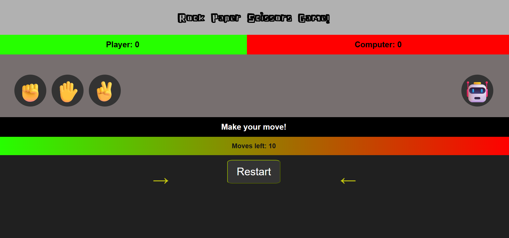

# 🪨📄✂️ Rock Paper Scissors Game

A fast-paced browser game where you play Rock, Paper, Scissors against the computer! First to score the most points in 10 moves wins.

## 🚀 Live Demo

👉 [Play the game here](https://thecodingkoala912.github.io/rock-paper-scissors/)



---

## ✨ Features

* Interactive rock, paper, scissors gameplay  
* Smooth UI feedback with emojis and color-coded messages  
* Shuffling computer choice animation  
* Move counter with 10-round limit  
* Score tracking and result alerts  
* Restart button to play again  
* Sound effect on game over *(customizable path)*  

---

## 🕹️ How to Play

1. Click ✊ (Rock), ✋ (Paper), or ✌ (Scissors) to make your move.
2. The computer shuffles and selects its move.
3. Scores are updated automatically.
4. You have **10 moves** to beat the computer!
5. Click **Restart** to play again.

---

## 💡 Game Logic

* Rock beats Scissors  
* Paper beats Rock  
* Scissors beats Paper  
* Tie if both choose the same  

Each round updates the message and scores based on the result. After 10 moves, the winner is announced via an alert.

---

## 🔉 Game Over Sound

The game plays a sound at the end using:

```js
const audio = new Audio("gameOverSound.wav");
